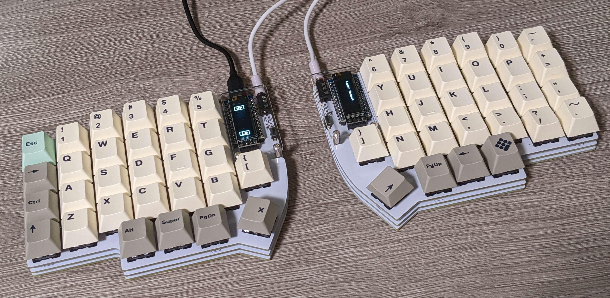

# ️⌨️ lily58-firm
The QMK firmware for [Lily58 Pro](https://kata0510.github.io/Lily58-Document/) by me.

## Build
### In local

#### Requirements
- QMK firmware
- [Just](https://github.com/casey/just) (optional but recommended)
- Python 3 (optional; if you are going to convert bmp image to C matrix)

#### Command

1. (if first build on the machine) run following to register this keymap
   ```bash
   just link-local
   ```

2. Run following to flash the firmware
   ```bash
   just flash
   ```

   - Flashing will run twice for flashing to both left and right keyboards.

## By hex file in Release
(TODO)
